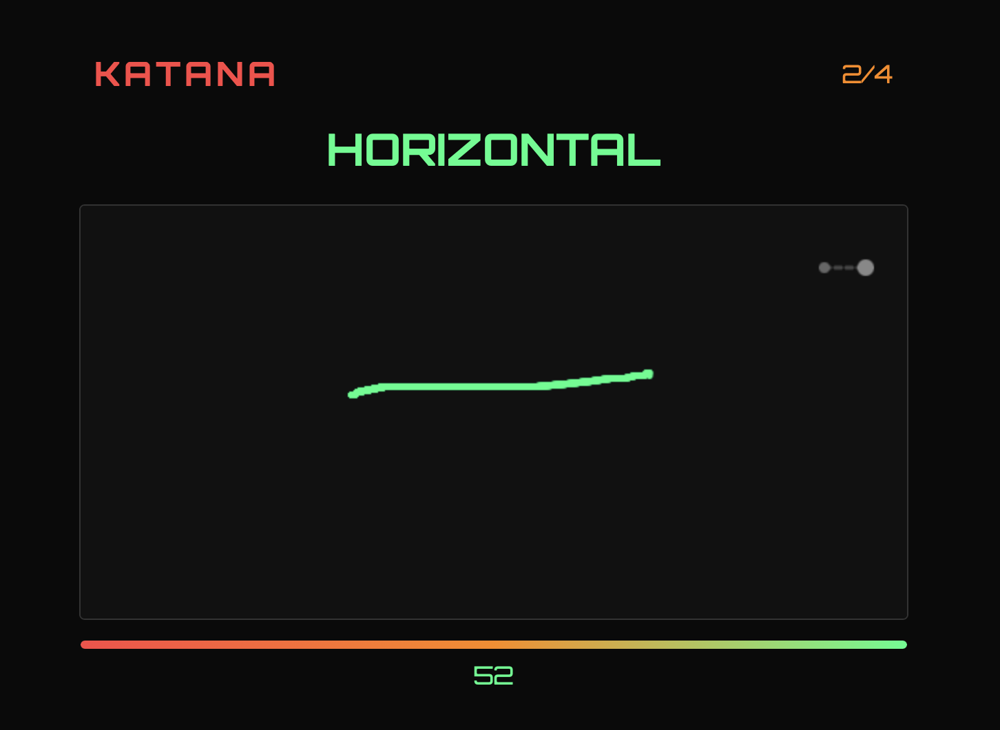
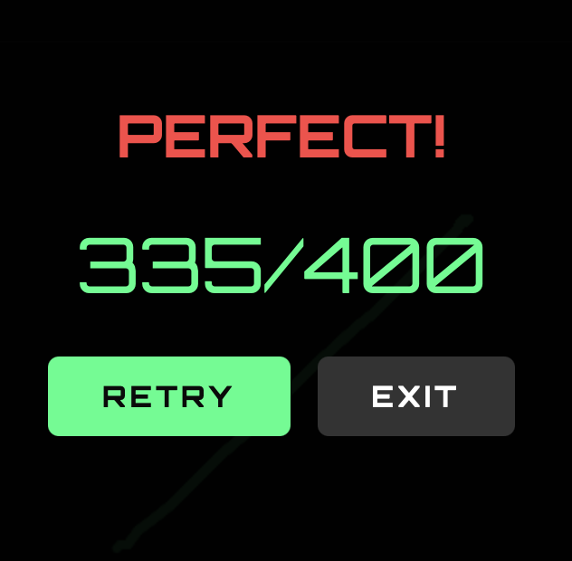

# Gothat X


A browser-based stroke accuracy game that challenges your precision and timing. Mimic sword cut strokes within a tight time limit to achieve high scores.



## How to Play

1. Open `katana-strike.html` in any modern web browser
2. Click **Start** to begin
3. Watch the target stroke animation (1.5 seconds)
4. Click, drag, and release within 1 second to mimic the stroke
5. Score 70+ points to clear each round
6. Complete all 4 rounds to see your final score

### Rounds
- **Round 1**: Horizontal cut (left → right)
- **Round 2**: Vertical cut (top → bottom)
- **Round 3**: Right diagonal (top-left → bottom-right)
- **Round 4**: Left diagonal (top-right → bottom-left)

### Scoring
- Score is based on accuracy (0–100)
- Endpoint accuracy: 60%
- Path deviation: 40%
- Clear threshold: 70 points per round

## Running Locally

No installation needed — this is a single HTML file with no dependencies.

```bash
# Option 1: Open directly
open katana-strike.html

# Option 2: Serve with any HTTP server
python3 -m http.server 8000
# Then visit http://localhost:8000/katana-strike.html
```

## Technical Details

- **Type**: Single-page HTML5 game
- **Rendering**: HTML5 Canvas (600×500px)
- **Styling**: Pure CSS with Orbitron font (Google Fonts)
- **Logic**: Vanilla JavaScript
- **Assets**: None — fully self-contained

## File Structure

```
gothatx/
├── katana-strike.html    # Main game file (standalone)
├── SPEC.md               # Game specification and mechanics
├── README.md             # This file
├── .gitignore            # Git ignore rules
└── screenshots/          # Gameplay screenshots
```

## Screenshots

| Start / Gameplay | Scorecard |
|---|---|
|  |  |

> Add more screenshots to the `screenshots/` folder. The table above updates automatically when pushed.

## Development

The game was built with a focus on smooth 60fps animation and precise stroke matching. See `SPEC.md` for the full design document.

## License

MIT License — feel free to fork, modify, and distribute.

---

Made with ⚔️ by Shankara
